# From Scratch to SIEM: Full Splunk Implementation and Automation with Docker

In this guide, I will take you on a step-by-step how to build a Security Information and Event Management (SIEM) environment using Splunk.

and we will go through automation the process Instead of running endless manual `dpkg` installation commands and tweaking configuration files one by one, so as a security automation engineer I will do this in a modern way: **Infrastructure as Code using Docker**.

### The Anatomy of Splunk: Core Components

Before starting we need to understand splunk components.

- **The Indexer:** Think of this as the heavy lifter. It receives raw log data, parses it, indexes it, and writes it to disk. When an analyst runs a search, the indexer executes the query against the data. Because of this, it requires high-speed I/O (SSDs are highly recommended).
- **The Search Head:** This is the analyst’s command center. It provides the web interface where you will run searches, build dashboards, and configure alerts. It is heavily reliant on memory.
- **The Universal Forwarder (UF):** These are your lightweight scouts. Installed directly on your endpoints (Windows, Linux, etc.), the UF operates quietly in the background, collecting logs and shipping them outbound to the Indexer over port `9997`.
- **The Heavy Forwarder (HF):** An optional but powerful intermediary node that can parse, filter, and route data *before* it ever hits your Indexer.
- **The Deployment Server:** When you have hundreds of endpoints, you don’t want to log into each one to update a configuration file. The Deployment Server acts as a central management hub to push updates to all your Universal Forwarders simultaneously.

### Infrastructure Requirements

We will be building this environment using VMware. To ensure reliable communication between the agents and the SIEM, all virtual machines must be placed on the same internal network using static IP addresses.

Here is the hardware provisioning you will need:

**1. The Splunk Server (Combined Indexer & Search Head)**

- **OS:** Ubuntu 22.04 LTS
- **IP Address:** `192.168.100.20`
- **CPU:** 4 vCPUs
- **RAM:** 4 GB
- **Storage:** 500 GB SSD

**2. Windows Endpoint**

- **OS:** Windows 11/10
- **IP Address:** `192.168.1.20`
- **CPU:** 2 vCPUs
- **RAM:** 4 GB
- **Storage:** 125 GB

**3. Linux Endpoint (Server Monitoring)**

- **OS:** Ubuntu 22.04 LTS
- **IP Address:** `192.168.1.30`
- **CPU:** 1 vCPU
- **RAM:** 4 GB
- **Storage:** 500 GB

### Downloading and Installing the Splunk Engine

The first step is installing the Splunk Enterprise installation package.

Navigate over to the official [Splunk Download Portal](https://www.splunk.com/).

Grab the `.deb` package for Linux.

### Installing Splunk (Linux)

```
wget -O splunk-9.4.6-60284236e579-linux-amd64.deb \
'https://download.splunk.com/products/splunk/releases/9.4.6/linux/splunk-9.4.6-60284236e579-linux-amd64.deb'

sudo dpkg -i splunk-9.4.6-60284236e579-linux-amd64.deb

# Check if splunk user exists
id splunk

# If it does NOT exist:
sudo useradd -r -m -d /opt/splunk splunk

# Give ownership
sudo chown -R splunk:splunk /opt/splunk

# Switch to splunk user
sudo su - splunk

# Start Splunk
/opt/splunk/bin/splunk start --accept-license

# Enable auto start with systemd
/opt/splunk/bin/splunk enable boot-start -user splunk --systemd-managed 1

# Check status
s/opt/splunk/bin/splunk status
```

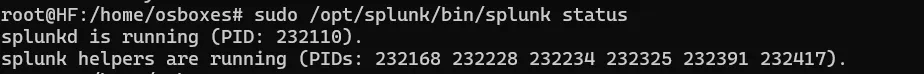

### Ports to be Allowed

```
sudo ufw allow 8000/tcp
sudo ufw allow 8089/tcp
sudo ufw allow 9997/tcp
sudo ufw allow 8088/tcp
sudo ufw reload
```

**Port Purpose**

- **8000** → Web UI
- **8089** → Management API
- **9997** → Forwarder ingestion
- **8088** → HTTP Event Collector

### Login & Admin Setup

Open `http://<your-splunk-server-ip>:8000` in a browser.

2. Login with the admin credentials you created.

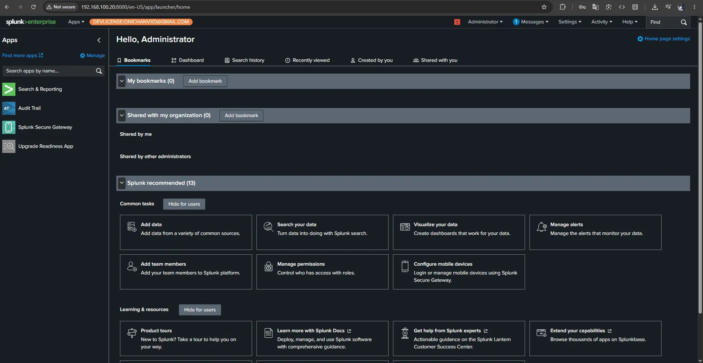

### Enable Receiving for Forwarders

Splunk does not listen for forwarders by default.

We Need To Enable receiving on the indexer:

- Just Go To **Settings** → **Forwarding and Receiving** → **Configure Receiving** → **New Receiving Port** → **9997**

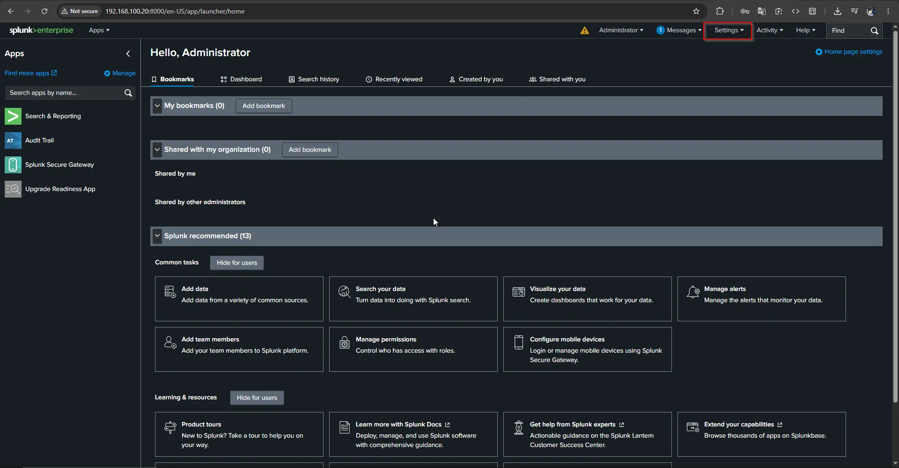

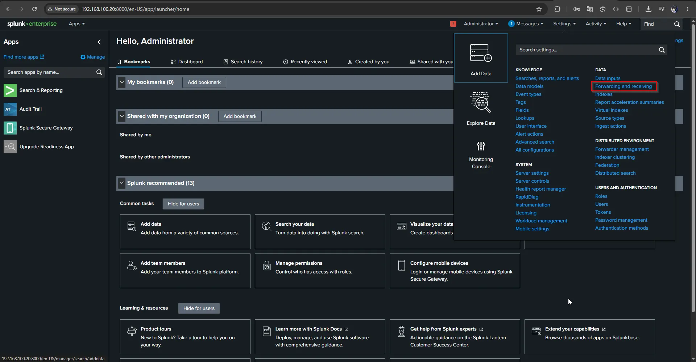

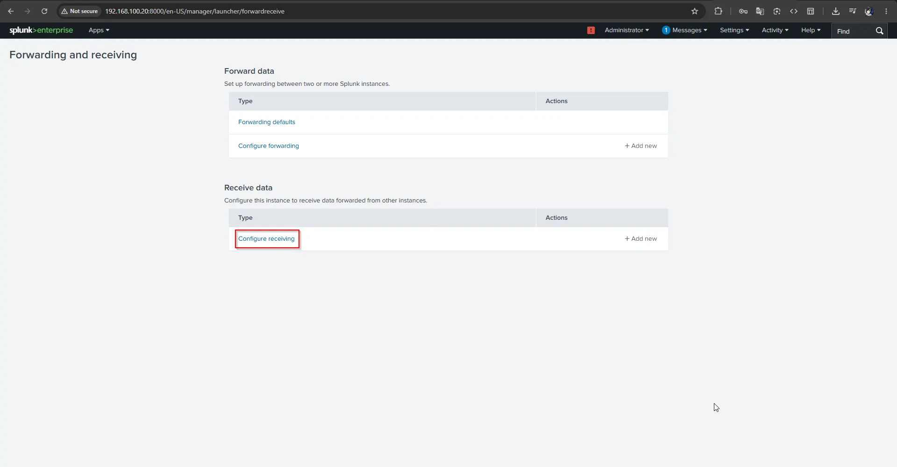

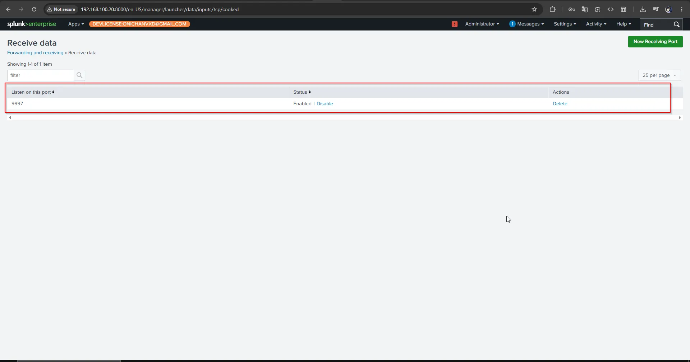

### Sysmon Installation & Configuration

I’ll be honest with you default Windows Event Logs just don’t cut it when you are hunting for advanced threats. they completely miss the good stuff.

you won’t see process creations with their full command-line arguments, you can’t track outbound network connections, and you have no visibility into file hashes or parent-child process relationships etc.

### Downloading Sysmon

Download from Microsoft Sysinternals:

```
https://docs.microsoft.com/en-us/sysinternals/downloads/sysmon
```

Or directly from the Sysinternals Suite:

```
https://download.sysinternals.com/files/Sysmon.zip
```

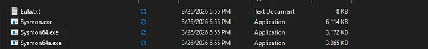

### Getting a Hardened Sysmon Configuration

We need a hardened XML configuration file that tells Sysmon what to monitor and what to filter out.

**SwiftOnSecurity (Community Standard)** Download from GitHub:

```
https://raw.githubusercontent.com/SwiftOnSecurity/sysmon-config/master/sysmonconfig-export.xml
```

### Installing Sysmon

Navigate to the directory where you have sysmon and sysmonconfig Open **Command Prompt as Administrator** and run:

```
sysmon64.exe -accepteula -i sysmonconfig.xml
```

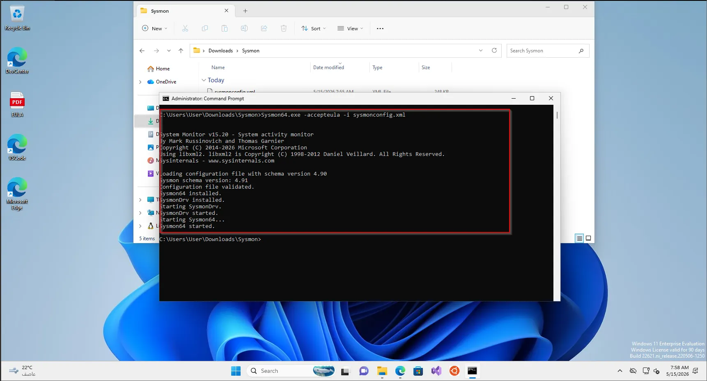

### Verifying Sysmon Is Running

Check the service status:

```
sc query Sysmon64
```

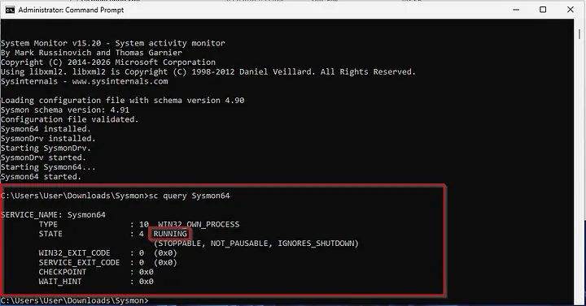

**Verify Events Are Appearing in Event Log:**

via PowerShell run:

```
# View the last 10 Sysmon events
Get-WinEvent -LogName "Microsoft-Windows-Sysmon/Operational" -MaxEvents 10 |
Select-Object TimeCreated, Id, Message | Format-Table -AutoSize
```

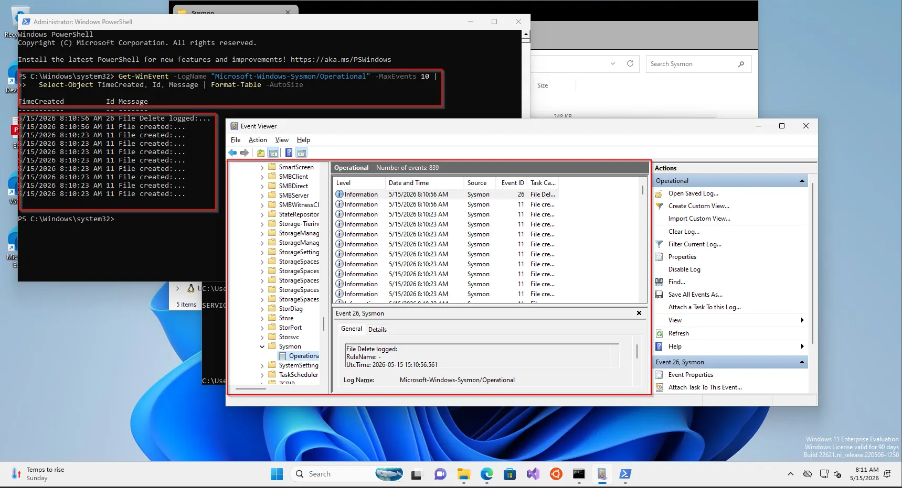

### Sample Sysmon Config Sections (XML)

Below are examples of key Sysmon XML configuration blocks illustrating the structure:

```
<Sysmon schemaversion="4.90">
  <!-- Strong baseline telemetry -->
  <HashAlgorithms>sha256,IMPHASH</HashAlgorithms>
  <DnsLookup>true</DnsLookup>
  <CheckRevocation>true</CheckRevocation>

  <EventFiltering>

    <!-- 1) Process Creation: log broadly, drop a little OS noise -->
    <RuleGroup name="ProcessCreate" groupRelation="or">
      <ProcessCreate onmatch="exclude">
        <Image condition="is">C:\Windows\System32\svchost.exe</Image>
        <Image condition="is">C:\Windows\System32\conhost.exe</Image>
        <Image condition="is">C:\Windows\System32\csrss.exe</Image>
        <Image condition="is">C:\Windows\System32\smss.exe</Image>
        <Image condition="is">C:\Windows\System32\wininit.exe</Image>
        <Image condition="is">C:\Windows\System32\services.exe</Image>
        <Image condition="is">C:\Windows\System32\lsass.exe</Image>
        <Image condition="is">C:\Windows\System32\fontdrvhost.exe</Image>
        <Image condition="is">C:\Windows\System32\audiodg.exe</Image>
        <Image condition="is">C:\Windows\System32\RuntimeBroker.exe</Image>
        <Image condition="is">C:\Windows\System32\WmiPrvSE.exe</Image>
        <Image condition="is">C:\Windows\System32\TiWorker.exe</Image>
        <Image condition="is">C:\Windows\System32\MoUsoCoreWorker.exe</Image>
        <Image condition="is">C:\Program Files\Windows Defender\MsMpEng.exe</Image>
        <Image condition="is">C:\Program Files\Windows Defender\NisSrv.exe</Image>
      </ProcessCreate>
    </RuleGroup>

    <!-- 2) Network Connections: capture all, let SIEM do the hunting -->
    <RuleGroup name="NetworkConnect" groupRelation="or">
      <NetworkConnect onmatch="include" />
    </RuleGroup>

    <!-- 3) File creation time changes (timestomping) -->
    <RuleGroup name="FileCreateTime" groupRelation="or">
      <FileCreateTime onmatch="include" />
    </RuleGroup>

    <!-- 4) Driver loads -->
    <RuleGroup name="DriverLoad" groupRelation="or">
      <DriverLoad onmatch="include" />
    </RuleGroup>

    <!-- 5) Image loads: only care about modules outside normal system/app paths -->
    <RuleGroup name="ImageLoad" groupRelation="or">
      <ImageLoad onmatch="exclude">
        <Image condition="begin with">C:\Windows\System32\</Image>
        <Image condition="begin with">C:\Windows\SysWOW64\</Image>
        <Image condition="begin with">C:\Windows\WinSxS\</Image>
        <Image condition="begin with">C:\Program Files\</Image>
        <Image condition="begin with">C:\Program Files (x86)\</Image>
      </ImageLoad>
    </RuleGroup>

    <!-- 6) Remote thread creation -->
    <RuleGroup name="CreateRemoteThread" groupRelation="or">
      <CreateRemoteThread onmatch="include" />
    </RuleGroup>

    <!-- 7) Raw disk access -->
    <RuleGroup name="RawAccessRead" groupRelation="or">
      <RawAccessRead onmatch="include" />
    </RuleGroup>

    <!-- 8) Process access: LSASS and a few sensitive targets -->
    <RuleGroup name="ProcessAccess" groupRelation="or">
      <ProcessAccess onmatch="include">
        <TargetImage condition="image">lsass.exe</TargetImage>
        <TargetImage condition="image">winlogon.exe</TargetImage>
        <TargetImage condition="image">services.exe</TargetImage>
        <TargetImage condition="image">samss.exe</TargetImage>
        <TargetImage condition="image">csrss.exe</TargetImage>
      </ProcessAccess>
    </RuleGroup>

    <!-- 9) File creates in high-value writable locations -->
    <RuleGroup name="FileCreate" groupRelation="or">
      <FileCreate onmatch="include">
        <TargetFilename condition="begin with">C:\Users\</TargetFilename>
        <TargetFilename condition="begin with">C:\ProgramData\</TargetFilename>
        <TargetFilename condition="begin with">C:\Windows\Temp\</TargetFilename>
        <TargetFilename condition="begin with">C:\Windows\Tasks\</TargetFilename>
        <TargetFilename condition="begin with">C:\Users\Public\</TargetFilename>
        <TargetFilename condition="contains">\AppData\Local\Temp\</TargetFilename>
        <TargetFilename condition="contains">\AppData\Roaming\Microsoft\Windows\Start Menu\Programs\Startup\</TargetFilename>
        <TargetFilename condition="contains">\Downloads\</TargetFilename>
        <TargetFilename condition="contains">\Desktop\</TargetFilename>
      </FileCreate>
    </RuleGroup>

    <!-- 10) Registry activity: persistence-focused keys -->
    <RuleGroup name="Registry" groupRelation="or">
      <RegistryEvent onmatch="include">
        <TargetObject condition="contains">\Software\Microsoft\Windows\CurrentVersion\Run</TargetObject>
        <TargetObject condition="contains">\Software\Microsoft\Windows\CurrentVersion\RunOnce</TargetObject>
        <TargetObject condition="contains">\Software\Microsoft\Windows\CurrentVersion\Policies\Explorer\Run</TargetObject>
        <TargetObject condition="contains">\Software\Microsoft\Windows NT\CurrentVersion\Windows\AppInit_DLLs</TargetObject>
        <TargetObject condition="contains">\Software\Microsoft\Windows NT\CurrentVersion\Image File Execution Options</TargetObject>
        <TargetObject condition="contains">\Software\Microsoft\Windows NT\CurrentVersion\SilentProcessExit</TargetObject>
        <TargetObject condition="contains">\Software\Microsoft\Windows NT\CurrentVersion\Winlogon</TargetObject>
        <TargetObject condition="contains">\System\CurrentControlSet\Services\</TargetObject>
        <TargetObject condition="contains">\Software\Microsoft\PowerShell</TargetObject>
        <TargetObject condition="contains">\Software\Microsoft\Windows\CurrentVersion\WINEVT\Publishers\</TargetObject>
        <TargetObject condition="contains">\Software\Classes\CLSID\</TargetObject>
      </RegistryEvent>
    </RuleGroup>

    <!-- 11) Named pipes -->
    <RuleGroup name="PipeEvent" groupRelation="or">
      <PipeEvent onmatch="include" />
    </RuleGroup>

    <!-- 12) WMI activity -->
    <RuleGroup name="WmiEvent" groupRelation="or">
      <WmiEvent onmatch="include" />
    </RuleGroup>

    <!-- 13) DNS queries -->
    <RuleGroup name="DnsQuery" groupRelation="or">
      <DnsQuery onmatch="include" />
    </RuleGroup>

    <!-- 14) File deletes -->
    <RuleGroup name="FileDelete" groupRelation="or">
      <FileDelete onmatch="include" />
    </RuleGroup>

    <!-- 15) Clipboard changes -->
    <RuleGroup name="ClipboardChange" groupRelation="or">
      <ClipboardChange onmatch="include" />
    </RuleGroup>

    <!-- 16) Process tampering -->
    <RuleGroup name="ProcessTampering" groupRelation="or">
      <ProcessTampering onmatch="include" />
    </RuleGroup>

    <!-- 17) File delete detected -->
    <RuleGroup name="FileDeleteDetected" groupRelation="or">
      <FileDeleteDetected onmatch="include" />
    </RuleGroup>

    <!-- 18) File stream hashes (ADS often used for hiding payloads) -->
    <RuleGroup name="FileCreateStreamHash" groupRelation="or">
      <FileCreateStreamHash onmatch="include" />
    </RuleGroup>

  </EventFiltering>
</Sysmon>
```

### Splunk Universal Forwarder Deployment

### Installing UF on Windows

```
https://www.splunk.com/en_us/download/universal-forwarder.html
```

Select: **Windows → 64-bit MSI**

**GUI Installation:**

1. Run the MSI installer as Administrator

2. Accept the license

3. Set admin username/password for the forwarder

4. Enter your Splunk indexer IP and port

5. Complete installation

### Installing UF on Linux

```
# Ubuntu/Debian
wget -O splunkforwarder-9.x.x-linux-2.6-amd64.deb \
'https://download.splunk.com/products/universalforwarder/...'
sudo dpkg -i splunkforwarder-9.x.x-linux-2.6-amd64.deb
# Start and accept license
sudo /opt/splunkforwarder/bin/splunk start - accept-license - answer-yes \
 - no-prompt - gen-and-print-passwd
# Enable boot start
sudo /opt/splunkforwarder/bin/splunk enable boot-start
```

```
# CentOS/RHEL
sudo rpm -ivh splunkforwarder-9.x.x-linux.x86_64.rpm
sudo /opt/splunkforwarder/bin/splunk start - accept-license
sudo /opt/splunkforwarder/bin/splunk enable boot-start
```

### Configuring `inputs.conf` (Windows)

The `inputs.conf` file specifies what data the forwarder collects. **File location on Windows:** `C:\Program Files\SplunkUniversalForwarder\etc\system\local\inputs.conf`

Create or edit this file with the following content:

```
# ============================================================
# WINDOWS EVENT LOGS - SECURITY
# ============================================================
[WinEventLog://Security]
index = wineventlog
disabled = false
sourcetype = WinEventLog:Security

# ============================================================
# WINDOWS EVENT LOGS - SYSTEM
# ============================================================
[WinEventLog://System]
index = wineventlog
disabled = false
sourcetype = WinEventLog:System

# ============================================================
# WINDOWS EVENT LOGS - APPLICATION
# ============================================================
[WinEventLog://Application]
index = wineventlog
disabled = false
sourcetype = WinEventLog:Application

# ============================================================
# SYSMON (CRITICAL FOR ENDPOINT CIM)
# ============================================================
[WinEventLog://Microsoft-Windows-Sysmon/Operational]
index = sysmon
disabled = false
sourcetype = XmlWinEventLog:Microsoft-Windows-Sysmon/Operational
renderXml = true

# ============================================================
# WINDOWS DEFENDER
# ============================================================
[WinEventLog://Microsoft-Windows-Windows Defender/Operational]
index = wineventlog
disabled = false
sourcetype = WinEventLog:Microsoft-Windows-Windows Defender/Operational

# ============================================================
# POWERSHELL
# ============================================================
[WinEventLog://Microsoft-Windows-PowerShell/Operational]
index = wineventlog
disabled = false
sourcetype = WinEventLog:Microsoft-Windows-PowerShell/Operational
```

> ***Note:***
> 
> 
> *Ensure PowerShell Script Block Logging is enabled via Group Policy. This generates Event ID 4104 and captures the full decoded content of every PowerShell script, vital for detecting obfuscated attacks.*
> 

### Configuring `inputs.conf` (Linux)

**File location on Linux:** `/opt/splunkforwarder/etc/system/local/inputs.conf`

```
# ============================================================
# AUTH LOGS - SSH, sudo, PAM events
# ============================================================
[monitor:///var/log/auth.log]
index = linux_logs
sourcetype = linux_secure
disabled = false
# ============================================================
# SYSLOG - General system messages
# ============================================================
[monitor:///var/log/syslog]
index = linux_logs
sourcetype = syslog
disabled = false
# ============================================================
# AUDITD - Kernel audit framework
# ============================================================
[monitor:///var/log/audit/audit.log]
index = linux_logs
sourcetype = linux_audit
disabled = false
# ============================================================
# DPKG / APT - Package installation tracking
# ============================================================
[monitor:///var/log/dpkg.log]
index = linux_logs
sourcetype = dpkg
disabled = false
# ============================================================
# CRON LOGS - Scheduled task execution
# ============================================================
[monitor:///var/log/cron.log]
index = linux_logs
sourcetype = syslog
disabled = false
# ============================================================
# APACHE / NGINX (uncomment if running a web server)
# ============================================================
#[monitor:///var/log/apache2/access.log]
#index = web_logs
#sourcetype = access_combined
#[monitor:///var/log/nginx/access.log]
#index = web_logs
#sourcetype = nginx_access
```

### Splunk Add-ons & CIM (Common Information Model)

### What is CIM and Why It Matters

The Common Information Model (CIM) is a standardized schema that normalizes fields from different log sources into consistent field names (e.g., translating various source formats into a standard `user` or `src_user` field).

CIM Data Models for Security include:

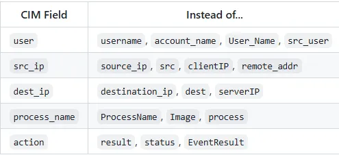

### Installing Add-ons from Splunkbase

Navigate to: `https://splunkbase.splunk.com`

**Required Add-ons for This Lab:**

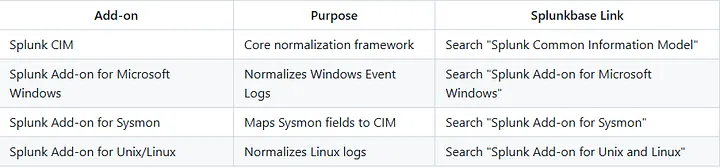

1. Log into Splunkbase and download the `.tgz` file

2. In Splunk Web, go to: **Apps → Manage Apps**

3. Click **Install app from file**

4. Click **Choose File** and select the downloaded `.tgz`

5. Click **Upload**

6. Restart Splunk when prompted

### Configuring the Sysmon Add-on

The Sysmon add-on requires specification of the correct index:

**Edit:** `/opt/splunk/etc/apps/Splunk_TA_microsoft-sysmon/local/inputs.conf`

```
[WinEventLog://Microsoft-Windows-Sysmon/Operational]
disabled = false
index = sysmon
renderXml = false
```

### **Verifying CIM Compliance**

Run these SPL searches to confirm your data is CIM-compliant:

```
| datamodel Authentication search | head 20
```

```
| datamodel Endpoint.Processes search | head 20
```

```
| datamodel Network_Traffic search | head 20
```

If these return data, your logs are correctly mapped to CIM data models.

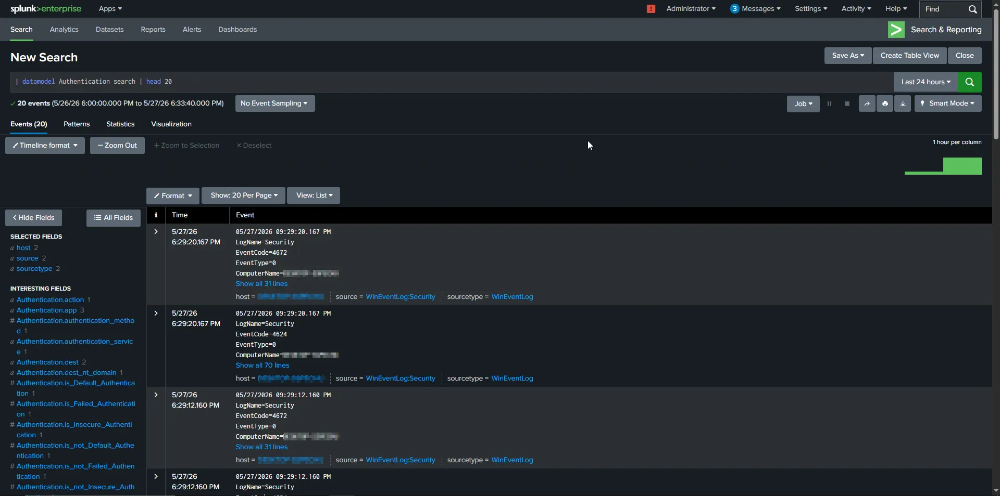

### **Check CIM Pivot (UI Method):**

- Go to: **Settings → Data Models**
- Click on **Authentication**
- Click **Pivot**
- If data appears, CIM normalization is working.

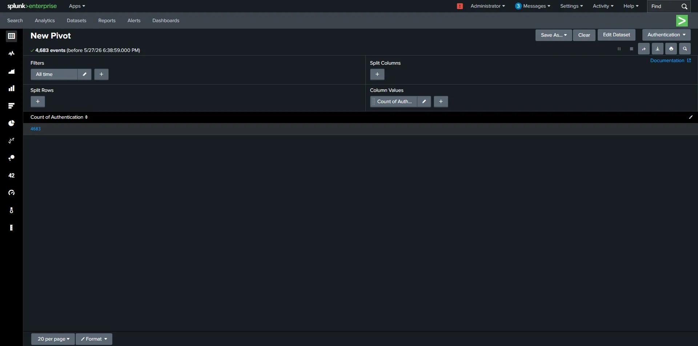

### SOC Detection Rules (SPL Queries)

we will make some SPL SOC query's to test our setup and detection.

### Windows Detection Rules

### Suspicious Process Creation (e.g.)

This catches common attacker behavior like PowerShell execution, encoded commands, or suspicious command-line usage. It WILL include false positives (admin activity, IT scripts), which is good for SOC learning examples.

```
index=sysmon EventCode=1
| search Image="*powershell.exe" OR Image="*cmd.exe"
| stats count by User, Computer, Image, CommandLine, ParentImage
| where count > 5
```

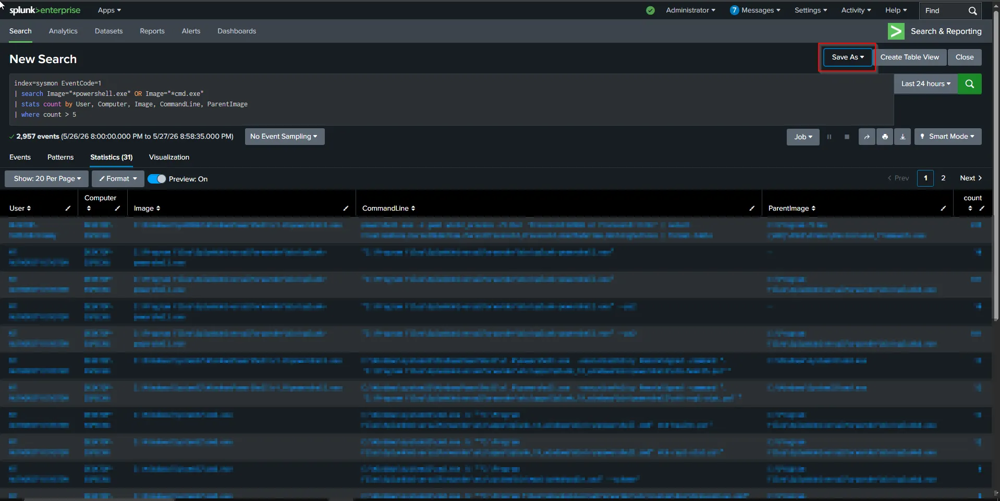

### Linux Detection Rules

### SSH Brute Force Attempts(e.g.)

Detects repeated SSH authentication failures indicative of brute-force or password spraying attacks.

```
index=linux_logs sourcetype=secure OR sourcetype=auth
"Failed password"
| stats count by src_ip, user
| where count > 10
```

### **Saving Searches as Alerts:**

To automate notifications for these detections:

- Run the query and click **Save As** → **Alert**.
- Configure the threshold and schedule.
- Assign an action, such as executing a webhook or sending an email notification to the SOC team.

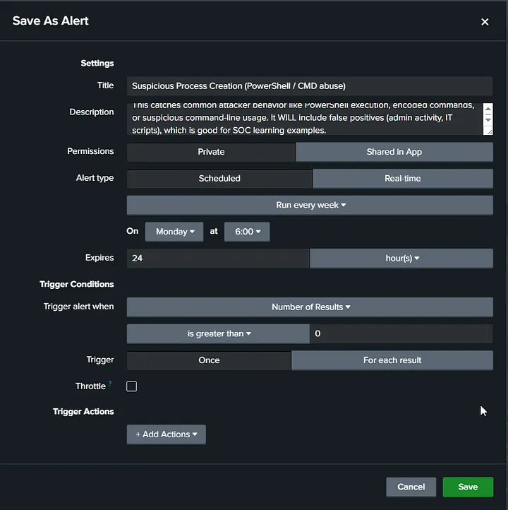

### Validation & Testing

After creating SPL detection queries, the next step is validating that the detections actually work in a real environment sao we will use tool called Atomic Red Team.

### Atomic Red Team

Atomic Red Team by Red Canary is an execution library for simulating MITRE ATT&CK techniques in a controlled manner.

**Installing Invoke-AtomicRedTeam (PowerShell Module)** Execute on the Windows test endpoint:

```
GitHub: https://github.com/redcanaryco/atomic-red-team
```

```
Set-ExecutionPolicy Bypass -Scope CurrentUser -Force
Install-Module -Name invoke-atomicredteam, powershell-yaml -Scope CurrentUser -Force
Import-Module invoke-atomicredteam
Invoke-Expression (IWR 'https://raw.githubusercontent.com/redcanaryco/invoke-atomicredteam/master/install-atomicredteam.ps1' -UseBasicParsing)
Install-AtomicRedTeam -getAtomics -Force
```

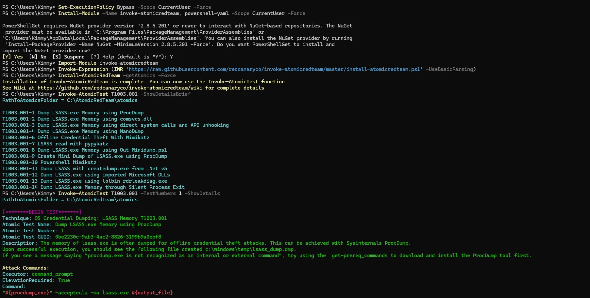

### Running Atomic Tests and Verifying Alerts

### **Test T1110 — Brute Force Login (Safe Simulation)**

```
for ($i = 0; $i -lt 10; $i++) {
    $username = "testuser"
    $password = ConvertTo-SecureString "WrongPassword$i" -AsPlainText -Force
    $cred = New-Object System.Management.Automation.PSCredential($username, $password)
    try {
        Start-Process cmd.exe -Credential $cred -ErrorAction SilentlyContinue
    } catch {}
}
```

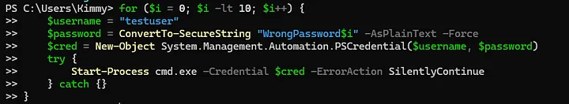

To verify the test generated the appropriate telemetry, run the following SPL query in Splunk:

Splunk SPL

```
index=wineventlog EventCode=4625 TargetUserName="testuser" earliest=-5m
| stats count BY TargetUserName, IpAddress
```

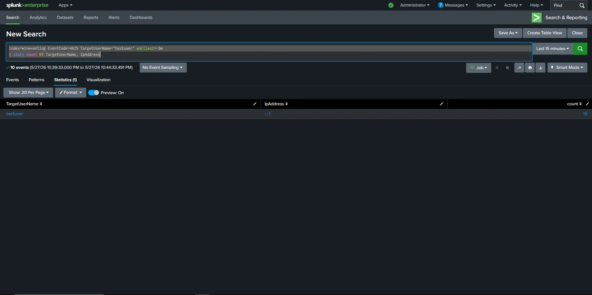

### DASHBOARDS

### Building a SOC Overview Dashboard

A well-designed SOC dashboard gives analysts **instant situational awareness** without running manual searches.

### Dashboard Creation via UI

1. Go to: **Search & Reporting → Dashboards**
2. Click: **Create New Dashboard**
3. Name it
4. Set permissions to **Shared in App**
5. Click **Classic Dashboards**

### Full XML Dashboard Source Code

Navigate to your dashboard and click **Edit → Edit Source (XML)**. Replace the entire content with the code below.

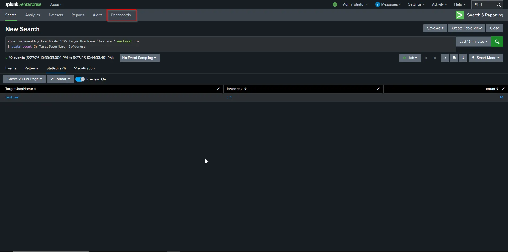

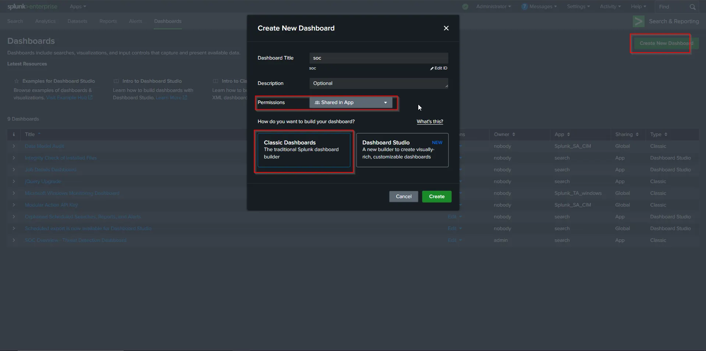

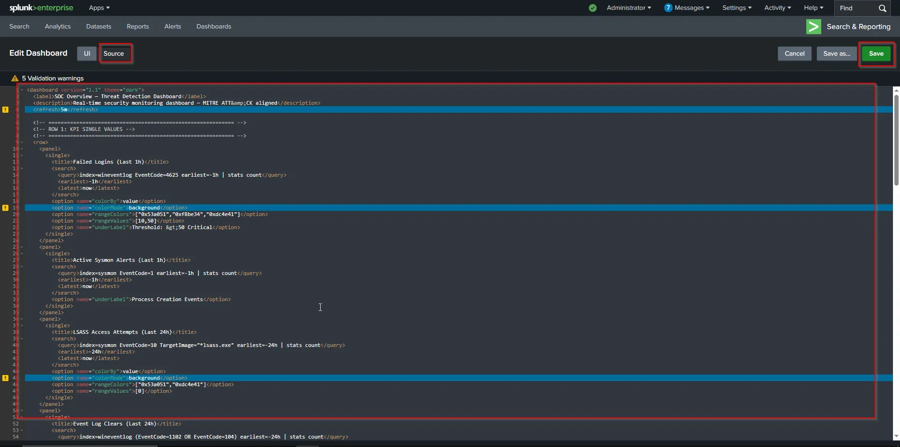

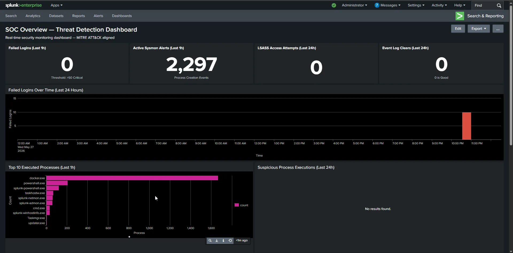

### The Modern Way — Automated Splunk Deployment via Docker

As a security automation engineer, I prefer to avoid running endless manual `dpkg` commands and tweaking configuration files one by one. Instead, we can deploy our entire Splunk SIEM architecture as Infrastructure as Code using Docker.

### 1. Directory Preparation

Before spinning up the container, create two specific folders in your working directory. These will be mapped as volumes into the Docker container:

- `deployment-apps/`: This folder will hold the applications and configurations for the Deployment Server (DS) to push out to your Universal Forwarders rather than configure it manual on each machine.
- `splunk-apps/`: Download your required Splunk Add-ons as `.tgz` files from Splunkbase and place them in here.

> **Note**
> 

### 2. The Docker Compose Configuration

Create a `docker-compose.yml` file. This file defines our Splunk server, accepts the license automatically, sets the admin password, and maps our critical ports and directories.

```
version: '3.8'
services:
  splunk:
    image: splunk/splunk:9.4.6
    container_name: splunk_idx_sh
    hostname: splunk-server
    environment:
      - SPLUNK_START_ARGS=--accept-license
      - SPLUNK_PASSWORD=@CHANGE_ME
      - SPLUNK_ROLE=splunk_standalone
    ports:
      - "8000:8000" # Web UI
      - "8089:8089" # Deployment/Management API
      - "9997:9997" # Forwarder Ingestion
    volumes:
      - splunk_etc:/opt/splunk/etc
      - splunk_var:/opt/splunk/var
      - ./splunk-apps:/tmp/splunk-apps
      - ./deployment-apps:/opt/splunk/etc/deployment-apps
    restart: unless-stopped
volumes:
  splunk_etc:
  splunk_var:
```

Run `docker compose up -d` and wait a few minutes for the container status to become "healthy" use the command`docker ps`.

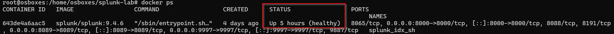

### 3. The Post-Deployment Automation Script

Once the container is running, we need to configure Splunk. Doing this through the Web UI takes time. Instead, I wrote a bash script that executes commands directly inside the Docker container to automate the entire backend configuration in one go.

Run this entire block of code in your terminal:

```
#!/bin/bash
echo "1. Enabling Receiving on Port 9997..."
docker exec -u splunk splunk_idx_sh /opt/splunk/bin/splunk enable listen 9997 -auth admin:99fe18nan9D
echo "2. Installing all Add-ons from the splunk-apps folder..."
docker exec -u splunk splunk_idx_sh bash -c 'for app in /tmp/splunk-apps/*.tgz; do /opt/splunk/bin/splunk install app "$app" -auth admin:99fe18nan9D -update 1; done'
echo "3. Creating Custom Indexes (wineventlog, sysmon, linux_logs)..."
docker exec -u splunk splunk_idx_sh bash -c 'cat <<EOF > /opt/splunk/etc/system/local/indexes.conf
[wineventlog]
homePath   = \$SPLUNK_DB/wineventlog/db
coldPath   = \$SPLUNK_DB/wineventlog/colddb
thawedPath = \$SPLUNK_DB/wineventlog/thaweddb
frozenTimePeriodInSecs = 7776000
maxTotalDataSizeMB = 51200
[sysmon]
homePath   = \$SPLUNK_DB/sysmon/db
coldPath   = \$SPLUNK_DB/sysmon/colddb
thawedPath = \$SPLUNK_DB/sysmon/thaweddb
frozenTimePeriodInSecs = 15552000
maxTotalDataSizeMB = 102400
[linux_logs]
homePath   = \$SPLUNK_DB/linux_logs/db
coldPath   = \$SPLUNK_DB/linux_logs/colddb
thawedPath = \$SPLUNK_DB/linux_logs/thaweddb
frozenTimePeriodInSecs = 7776000
maxTotalDataSizeMB = 20480
EOF'
echo "4. Enabling the Deployment Server..."
docker exec -u splunk splunk_idx_sh /opt/splunk/bin/splunk enable deploy-server -auth admin:99fe18nan9D
echo "5. Automating Deployment Server Classes (serverclass.conf)..."
docker exec -u splunk splunk_idx_sh bash -c 'cat <<EOF > /opt/splunk/etc/system/local/serverclass.conf
[serverClass:Windows_Endpoints]
machineTypesFilter = windows
restartSplunkd = true
[serverClass:Windows_Endpoints:app:windows_forwarder_config]
stateOnClient = enabled
restartSplunkd = true
EOF'
echo "6. Configuring Sysmon Add-on Parsing on Indexer..."
docker exec -u splunk splunk_idx_sh bash -c 'mkdir -p /opt/splunk/etc/apps/Splunk_TA_microsoft-sysmon/local && cat <<EOF > /opt/splunk/etc/apps/Splunk_TA_microsoft-sysmon/local/inputs.conf
[WinEventLog://Microsoft-Windows-Sysmon/Operational]
disabled = false
index = sysmon
renderXml = false
EOF'
echo "7. Restarting Splunk to apply all configurations..."
docker compose restart
```

### 4. Verifying and Configuring the Deployment Server

Now that our backend automation has executed, we need to verify that the Deployment Server (DS) is active and properly routing our configurations via the Splunk Web UI.

1. Log in to Splunk Web and navigate to **Settings** → **Forwarder Management**.
2. This is your central hub for monitoring all connected Universal Forwarder agents. Because of the automation script we ran earlier, you should automatically see a Server Class pre-configured under the name **Windows_Endpoints**. *(Note: If you skipped the automation script, you can manually create a new Server Class from this menu).*

The final step is to assign our deployment configuration app to this specific group:

1. Within the Forwarder Management dashboard, locate your deployment apps (this maps directly to the configurations we placed in the mapped `deployment-apps` Docker folder).
2. Edit the **Windows_Endpoints** Server Class and assign your Windows configuration app to it.

**Why do we do this?** By mapping this configuration app to the Server Class, you are creating an automated provisioning pipeline. Whenever a new Windows machine joins your SIEM and checks in with the Deployment Server, it will automatically download its designated configuration and begin forwarding logs.

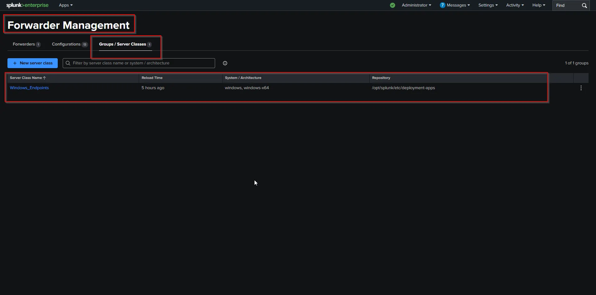

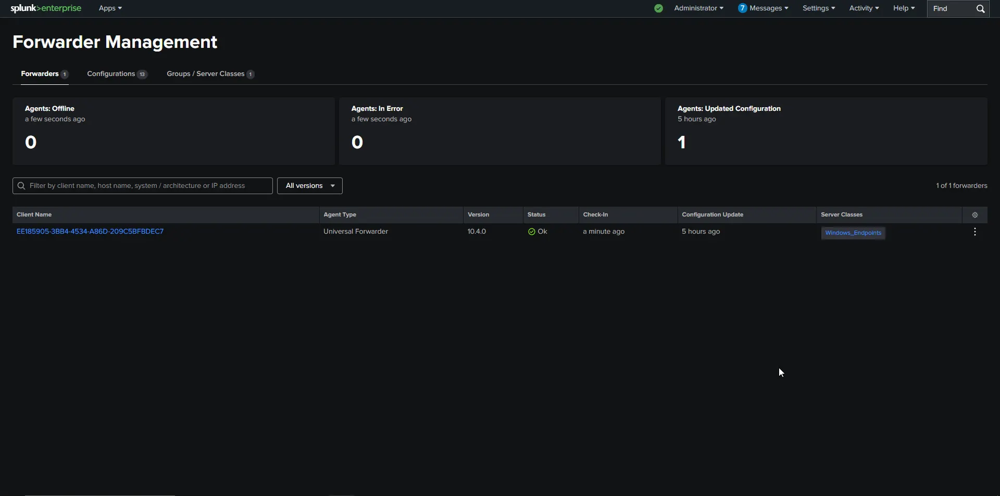

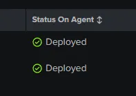

### Breaking Down the Automation

To understand the mechanics happening under the hood, here is a breakdown of what the script achieves:

- **Enables Receiving (Port 9997):** Opens the listener on the indexer so it can securely receive logs from the Universal Forwarders.
- **Batch Installs Add-ons:** Loops through your mapped `splunk-apps` folder and silently installs every downloaded `.tgz` Splunkbase add-on.
- **Creates Custom Indexes:** Dynamically generates an `indexes.conf` file. This partitions your data into specific buckets (`wineventlog`, `sysmon`, `linux_logs`) while establishing data retention policies and disk size limits to prevent your server from crashing.
- **Enables the Deployment Server:** Activates Splunk’s built-in central management hub.
- **Automates Server Classes:** Generates a `serverclass.conf` file to create a deployment group specifically for Windows endpoints, preparing it to push out the configurations stored in your `deployment-apps` directory.
- **Configures Sysmon Parsing:** Directs the Splunk Sysmon Add-on to correctly route and render logs into your newly created `sysmon` index.
- **Restarts Splunk:** Triggers a container restart to seamlessly apply all backend configuration changes at once.

### Conclusion: Building the Automated Foundation

Deploying a SIEM from scratch doesn’t have to be a manual, tedious process. By leveraging Docker and Infrastructure as Code, we successfully implemented a full Splunk architecture — complete with endpoint visibility via Sysmon, log routing, and automated backend configurations — in a fraction of the time.

But getting the infrastructure running and the data flowing is just step one. Now that we have a solid, automated foundation, we can start turning this raw telemetry into actionable intelligence.

In future guides, we will expand on this setup by diving into:

- **Custom Indexes:** Optimizing data storage and retention policies.
- **Advanced Alerting:** Building real-time and scheduled alerts to catch active threats.
- **SOC Integrations:** Connecting Splunk to external incident response platforms and SOAR tools to handle alerts at machine speed.

The infrastructure is built now the real engineering begins.