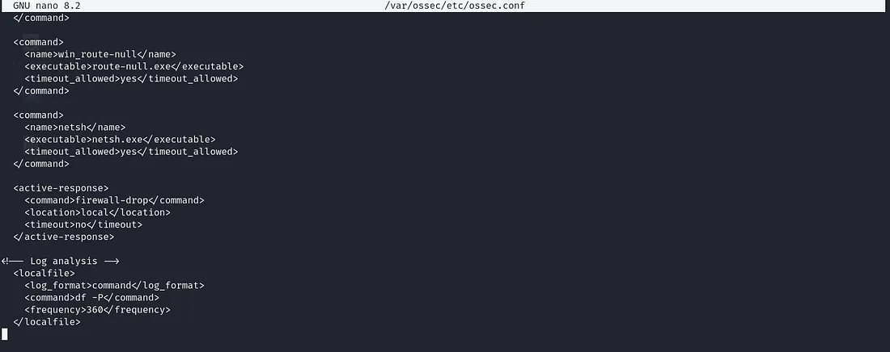
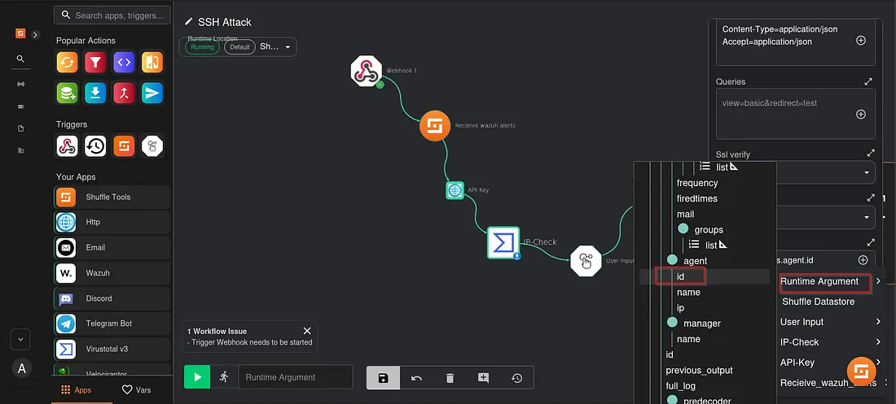

---

Author: Rakan Adnan (Kimmy)

Date: 3 April 2025

---

### SOC Automation Lab — By Kimmy


**In this article, I will provide a comprehensive guide on setting up a Security Operations Center (SOC) lab. I will demonstrate the implementation of Wazuh SIEM, including the deployment and configuration of agents. Additionally, I will walk through an attack scenario to showcase how Wazuh detects security threats and response to them. Finally, I will explore the integration of automation in a SOC analyst environment using Shuffle SOAR.**


## What is a SIEM?

**Security Information and Event Management** the point of a SIEM is to collect, aggregate, and analyze large volumes of data from organization-wide applications, devices, servers, and users in real time in other words its (log collector).

## What is a SOAR?

**Security Orchestration, Automation, and Response** the point of a SOAR platform is to handle an incident end-to-end — automating before, during and after the incident.

## Wazuh

### What is Wazuh?

Wazuh is a free and open source platform used for threat prevention, detection, and response. It is capable of protecting workloads across on-premises, virtualized, containerized, and cloud-based environments you can explore more on the [Wazuh website](https://wazuh.com/).

### Wazuh Components

1. **Wazuh indexer**:  
   Its search engine it do central component indexes and stores alerts that come from Wazuh server.

2. **Wazuh server**:  
   The server analyze the data received from the Wazuh agents to clear this you install the agent on the device you want to monitor this agent will send the logs you want to the server and it will be stored in the index to get analyzed later.

3. **Wazuh agent**:  
   Its multi-platform and it runs on the device that we want to monitor it sends the info or the logs that we want to monitor to the server.

4. **Wazuh dashboard**:  
   It's a web interface for analyzing the security data its just a ui to summarize the state.

## Step-by-Step Installation of Wazuh

### First Download Wazuh installation assistant and the configuration file.

```bash
curl -sO https://packages.wazuh.com/4.11/wazuh-install.sh
curl -sO https://packages.wazuh.com/4.11/config.yml

```

After download two files will shows up:

-   `wazuh-install.sh` (installation script)
-   `config.yml` (configuration file)

### Configuring the Wazuh Installation

Before proceeding with the installation, we need to configure `config.yml` by defining the IP addresses of the Wazuh components. It is recommended to assign static IP addresses to ensure stability.

```yaml
nodes:
  # Wazuh indexer nodes
  indexer:
    - name: node-1
      ip: "<indexer-node-ip>"
    #- name: node-2
    #  ip: "<indexer-node-ip>"
    #- name: node-3
    #  ip: "<indexer-node-ip>"

  # Wazuh server nodes
  # If there is more than one Wazuh server
  # node, each one must have a node_type
  server:
    - name: wazuh-1
      ip: "<wazuh-manager-ip>"
    #  node_type: master
    #- name: wazuh-2
    #  ip: "<wazuh-manager-ip>"
    #  node_type: worker
    #- name: wazuh-3
    #  ip: "<wazuh-manager-ip>"
    #  node_type: worker

  # Wazuh dashboard nodes
  dashboard:
    - name: dashboard
      ip: "<dashboard-node-ip>"

```

Replace `<indexer-node-ip>`, `<wazuh-manager-ip>`, and `<dashboard-node-ip>` with your actual IP addresses.

### Generating Configuration Files

Once the `config.yml` file is updated, run the following command to generate the necessary configuration files:

```bash
bash wazuh-install.sh --generate-config-files

```

This process will create a compressed file (`wazuh-install-files.tar`), which contains all the required configurations, including the admin credentials.

### Installing Wazuh

To install Wazuh, execute the following command:

```bash
sudo bash ./wazuh-install.sh -a

```

The `-a` flag ensures an all-in-one installation, setting up all components on a single machine.  
Once the installation is complete, make sure to save the admin password displayed on the screen.  

You can now access the Wazuh dashboard by navigating to `https://your-ip`.


## Automating the Installation Process

To simplify the installation, I have created a script that automates the entire process, including downloading the required files, configuring IP addresses, and executing the installation.

### Automated Wazuh Installation Script

```bash
#!/bin/bash

# Download the required files
curl -sO https://packages.wazuh.com/4.11/wazuh-install.sh
curl -sO https://packages.wazuh.com/4.11/config.yml

# Ensure files exist
if [[ ! -f "wazuh-install.sh" || ! -f "config.yml" ]]; then
    echo "Error: Failed to download required files. Exiting."
    exit 1
fi

# Prompt user for IP configuration
echo "Enter the IP address for Wazuh Indexer: "
read indexer_ip

echo "Do you want the same IP for all three Indexer nodes and the Dashboard? (yes/no)"
read same_ip

if [[ "$same_ip" == "yes" ]]; then
    server_ip=$indexer_ip
    dashboard_ip=$indexer_ip
else
    echo "Enter the IP address for Wazuh Server: "
    read server_ip
    echo "Enter the IP address for Wazuh Dashboard: "
    read dashboard_ip
fi

# Update config.yml with user-provided IPs
sed -i "s/<indexer-node-ip>/\"$indexer_ip\"/" config.yml
sed -i "s/<wazuh-manager-ip>/\"$server_ip\"/" config.yml
sed -i "s/<dashboard-node-ip>/\"$dashboard_ip\"/" config.yml

# Run the installation steps
sudo bash wazuh-install.sh --generate-config-files
sudo bash wazuh-install.sh -a

echo "Wazuh installation completed successfully script done by Kimmy."

```

## Deploying a New Agent from the Wazuh Dashboard

### 1. Access the Wazuh Dashboard

-   Navigate to the **Agent Summary** section.
-   Click on **Deploy New Agent** to begin the deployment process.


### 2. Configure the Windows Agent

-   Select **Windows** as the operating system.
-   Enter the **Wazuh Server IP** to establish communication between the agent and the server.
-   Assign a unique **agent name** for identification.


---


### 3. Install and Start the Agent

Run the following commands on the Windows system to ensure the agent is installed and running correctly:

```powershell
Get-Service WazuhSvc

```

Verify that the `WazuhSvc` service is active.


## Installing Sysmon for Advanced Monitoring

**Sysmon** (System Monitor) is a Windows system service that logs detailed system activity.

### 1. Download and Install Sysmon

-   Download Sysmon from the official Microsoft website: [Sysmon](https://docs.microsoft.com/en-us/sysinternals/downloads/sysmon).
-   Extract the Sysmon files to a designated folder.

### 2. Configure Sysmon

-   Download a pre-configured Sysmon ruleset from the following repository: [Sysmon Configuration](https://github.com/SwiftOnSecurity/sysmon-config).
-   Extract the Sysmon configuration file and place it in the Sysmon folder.

### 3. Apply the Sysmon Configuration

Run Sysmon with the downloaded configuration to start monitoring system activity effectively:

```powershell
.\Sysmon64.exe -i .\sysmonconfig.xml

```


To make sure the service is running, run:

```powershell
Get-Service Sysmon64

```

## Forwarding Sysmon Logs to Wazuh

To collect Sysmon logs in Wazuh, we need to modify the `ossec.conf` file located at:  
`C:\Program Files (x86)\ossec-agent`

### 1. Edit the ossec.conf File

Add the following configuration to enable Sysmon log forwarding:

```xml
<localfile>
    <location>Microsoft-Windows-Sysmon/Operational</location>
    <log_format>eventchannel</log_format>
</localfile>

```


### 2. Restart the Wazuh Agent Service

Run the following command to apply the changes:

```powershell
Restart-Service WazuhSvc

```

## Adding a Linux Agent to Wazuh

To add a Linux agent to Wazuh, follow these steps:

### 1. Access the Wazuh Dashboard

-   Navigate to the **Agent Summary** section.
-   Click on **Deploy New Agent** to initiate the deployment process.


### 2. Install the Wazuh Agent on Linux

Run the following commands on the Linux machine to install and register the agent:


> Here we have two agents on Wazuh: one is Windows, and one is Linux.

---

## Shuffle

### What is Shuffle?

Shuffle is an open-source **Security Orchestration, Automation, and Response (SOAR)** platform that helps automate security workflows you can explore more on the [Shuffle website](https://shuffler.io/).

### Installing and Configuring Shuffle

#### 1. Install Docker and Docker-Compose

Ensure Docker and Docker-Compose are installed on your system by running:

```bash
sudo apt install -y docker.io docker-compose
sudo systemctl enable docker
sudo systemctl start docker

```

#### 2. Download and Run Shuffle

Clone the Shuffle repository and start the service using Docker-Compose:

```bash
git clone https://github.com/Shuffle/Shuffle.git
cd Shuffle
sudo docker-compose up -d

```

#### 3. Access the Shuffle Web Interface

Open your web browser and navigate to:

```
https://your-ip:3001

```

#### 4. Apply Required Configurations

Run the following commands to set correct permissions and restart required services:

```bash
sudo chown -R 1000:1000 shuffle-database
sudo swapoff -a
sudo docker restart shuffle-opensearch

```


Sign up for an account on the Shuffle web interface and log in.

> **Note**: After creating a workflow, you will notice some applications are missing. To fix this, follow the steps provided in the Shuffle documentation.


## SSH Attack Simulation and Detection with Automation

To enhance security monitoring, we will simulate an SSH attack, configure Wazuh to detect it, and automate the response using Shuffle.

### Simulating an SSH Attack

Run the following command using `netexec` to attempt an SSH brute-force attack:

```bash
netexec ssh ip_address -u users.txt -p passwords.txt

```


### Configuring Wazuh to Detect SSH Brute Force Attempts

#### 1. Monitor Wazuh Alerts

-   Wazuh generates alerts when SSH brute-force attempts occur.
-   An alert is triggered after three failed SSH attempts with **Event ID 5710**.


#### 2. Setting Up Active Response in Wazuh

Edit the `ossec.conf` file on the Wazuh manager located at:

```
/var/ossec/etc/ossec.conf

```

Add the following active response configuration to drop traffic from detected attackers:

```xml
<active-response>
    <command>firewall-drop</command>
    <location>local</location>
    <timeout>no</timeout>
</active-response>

```


**Edits breakdown**:

-   `<command>the option i want to use</command>`
-   `<location>local</location>` → what local mean that the host that generated the alert that where the script will run
-   `<timeout>no</timeout>`

Restart the Wazuh service:

```bash
systemctl restart wazuh-manager

```

#### Important Consideration for API Usage

When using Active Response with APIs, the command name appends the timeout value to the name, but it remains hidden. For example, if the command is set to `firewall-drop` and the timeout is `0` (or `no`), you must append the timeout when using the API.

#### Verifying Active Response Script

To check whether the active response script is running, use the agent control binary located at:

```
/var/ossec/bin/agent_control

```



#### Testing Active Response

Run the following command to manually block an IP:

```bash
./agent_control -b 8.8.8.8 -f firewall-drop0 -u 002

```

`u` specifies the agent ID (`002` in this example), which can be found in the Wazuh dashboard.  
This command will block traffic from the specified IP (e.g., `8.8.8.8`).

> **Linux agent before active response**: 


> **Linux agent after active response**:


#### Viewing Active Response Logs

To verify actions taken by active response, check the logs at:

```
/var/ossec/logs/active-responses.log

```

## Automating SSH Attack Mitigation with Shuffle

In this section, we will configure a workflow in Shuffle to automate blocking any source IP that attempts to connect to our Linux machine via SSH.

### Step 1: Setting Up a Webhook in Shuffle

1.  Log in to Shuffle.
2.  Navigate to **Workflows** and create a new workflow.
3.  Add a **Webhook** trigger to receive alerts from Wazuh.
4.  Configure the webhook to parse incoming alert data.


Now we need to add the webhook on the Wazuh server. Open `/var/ossec/etc/ossec.conf`, create `<hook_url>` tags, and put the webhook there.


> **Note**: We did put the `<rule_id>5764</rule_id>` to tell Wazuh to send the alert with this `rule_id` to the webhook.

Restart the service.

### Step 2: Configuring VirusTotal Integration

1.  From the **Apps** section on the left side of Shuffle, select **VirusTotal**.
2.  Configure the app by entering your VirusTotal API key (retrieved from your VirusTotal account).
3.  Change the **File Action** to **Get an IP Address Report**.
4.  In the **IP** section, enter the following value:

```


$exec.all_fields.agent.ip

```

### Step 3: Configuring HTTP App for API Execution

1.  Add the **HTTP** app to the workflow.
2.  Change the action type to **curl** to send API requests.
3.  Get the **JWT token**:


```bash
curl -u username:password -k -X GET "https://wazuh_ip:55000/security/user/authenticate?raw=true"

```

### Step 4: Sending Alerts to Discord

To enhance monitoring, we will send messages when the alert hits to a Discord server where the SOC team can review them and decide whether to block the IP:

1.  Create a **Discord Server** if you don't have one.
2.  Go to the **general channel** (or any preferred channel) where you want to receive alerts.
3.  Create a **Discord bot** and generate a **Webhook URL**.
4.  Copy the Webhook URL for later use.


### Step 5: Configuring the Discord App in Shuffle

1.  Make another workflow, drag the **Discord** app.
2.  Paste the **Discord bot Webhook URL** into the URL field.
3.  Change the **find actions** to **send a message**.
4.  Go to **Advanced Settings** and configure the JSON body as you like (how the message would look and to receive):


```json
{
  "content": "**$exec.information**\n$exec.frontend_continue\n$exec.frontend_abort"
}

```

### Step 6: Adding User Input for SOC Analyst Decision

To allow SOC analysts to choose whether to block an IP (like sending yes or no to Wazuh active response to run), follow these steps:

1.  Add a **User Input** app in the workflow.
2.  In the **Information Section**, define the message to be displayed.
3.  To include the source IP address in the message, use:

```
$exec.all_fields.data.srcip

```

4.  In the **Input Option**, select the desired method to send the message.
5.  If you have already set up a Discord alert workflow, choose **Subflow** and select the Discord workflow.


### Step 7: Configuring Wazuh App for Active Response

1.  Add the **Wazuh** app to the workflow.
2.  Assign the **API key** (retrieved from the HTTP app, named `API-Key`).


3.  Set the **Shuffle URL** with port `55000`.


4.  Scroll down and enter the **Agent List**:
    -   Retrieve the **Agent ID** from the Wazuh dashboard under **Agents**.
    -   Alternatively, make it dynamic using runtime argument → `agent` → `id`.


5.  In the **Command** section, enter the active response action:

```
firewall-drop0

```



> **Note**: If we went back to our logs for the active response, we see how it takes the IP. The IP that we want to block exists in the alert section in this format:


> It tells me that ip should be in alert section in this format
> `{"data":{"the_ip"}}`  
> Now we want the source IP. You can type it like this: `$exec.all_fields.data.srcip` or by going to VirusTotal queries section runtime argument → `data` → `srcip`.


## Final Test

### Step 1: Check for Blocked IPs

Before launching the attack, let's check if there are any blocked IPs.


### Step 2: Launch the Attack

Next, we initiate the SSH brute-force attack.


### Step 3: Check Wazuh Alerts

Once the attack is launched, we check the Wazuh alerts.


### Step 4: Check Discord Message

Now, we check if a message has been sent to the Discord server.  
The URL above is for blocking the IP, and the second is for unblocking.


### Step 5: Waiting for Input in Shuffle

At this stage, Shuffle is waiting for input before taking action.


### Step 6: Blocking the IP

Now, we go to the Shuffle URL to block the IP.  
Visit the URL:

```
https://shuffle_ip:3001/first_url

```


### Step 7: Confirm the Block

After confirming to block the IP, we check back in Shuffle to verify the action has been completed.


### Step 8: Verify on the Linux Machine

Finally, we verify on the Linux machine to check if the IP has been blocked.  
We can confirm that we are unable to ping or connect to the Linux machine from the attacker's machine, confirming that the block was successful.


## Conclusion

This article involves setting up a Security Operations Center (SOC) lab with Wazuh SIEM. It covers deploying and configuring Wazuh agents, simulating an attack to demonstrate threat detection and response, and integrating automation using Shuffle SOAR to enhance SOC operations.

----------

_created by Rakan Adnan._  
